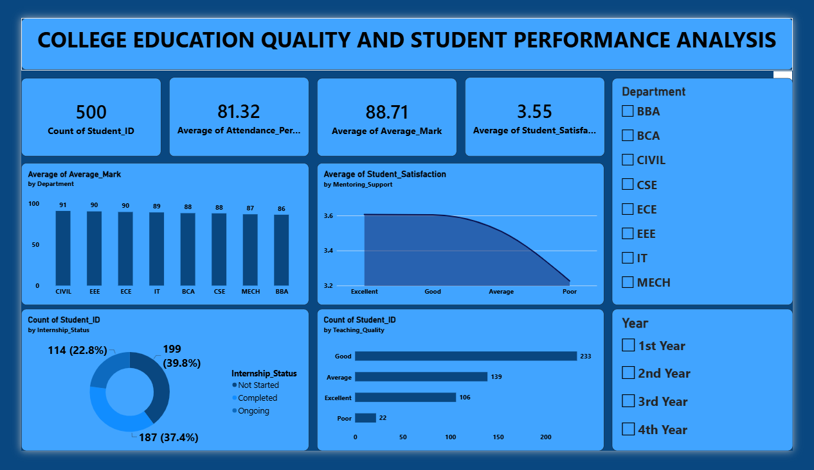

# PowerBI-Student-Performance
Interactive Power BI dashboard analyzing Anna University student database, covering academic performance, attendance, internships, satisfaction, and teaching quality. Provides department-wise and year-wise insights through interactive visualizations and filters.

# 🎓 College Education Quality and Student Performance Analysis

## 📊 Project Overview

This project is an interactive Power BI dashboard created using an Anna University student database. It analyzes student academic performance, attendance, satisfaction, mentoring support, internship status, and teaching quality.

The dashboard allows users to explore the data using department-wise and year-wise filters.

## 📷 Dashboard Preview

## 🎥 Dashboard Demo

[▶️ View Dashboard Demo](dashboard_demo.mp4)

## 🔍 Key Features

- Total student count
- Average attendance
- Average marks
- Student satisfaction analysis
- Department-wise performance
- Mentoring support analysis
- Internship status
- Teaching quality
- Department and year filters

## 🛠️ Tools Used

- Power BI
- DAX
- Data Analysis
- Data Visualization

## 🎯 Objective

To analyze student-related data and identify patterns in academic performance, attendance, internships, satisfaction, mentoring support, and teaching quality.

## 👤 Author

**Prenesh Kumar R**
